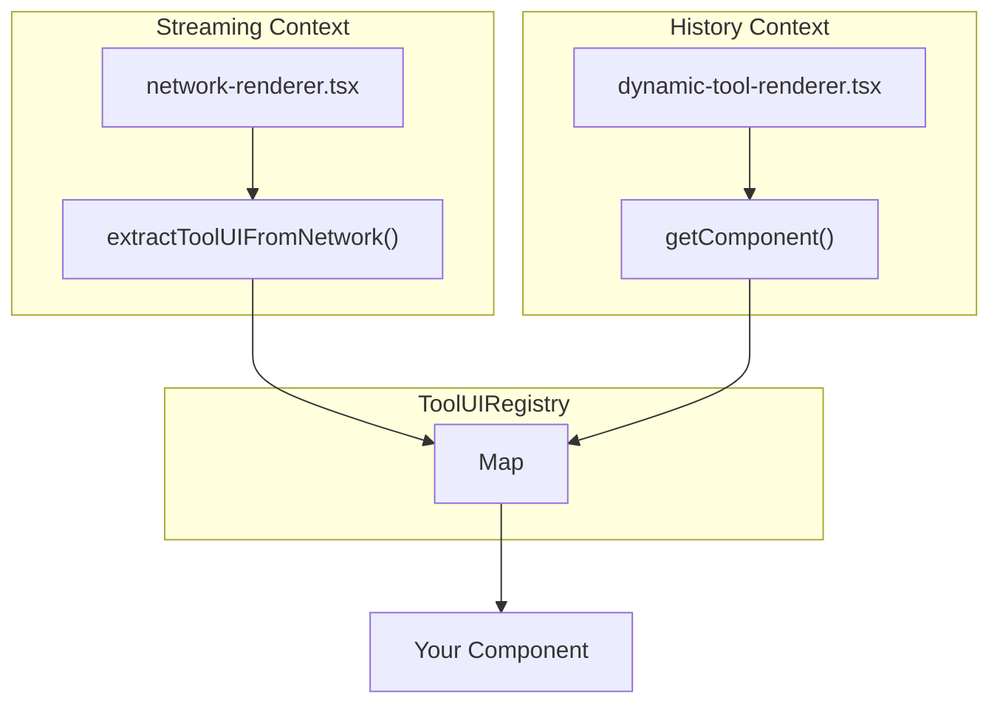

# Tool UI Skill

**Status**: Production Ready  
**Last Updated**: 2026-01-21  
**Dependencies**: `@/components/chat/renderers`

---

## Quick Start

To add a custom UI for a new tool:

```bash
/add-tool-ui my-tool-name
```

Or follow the manual steps below.

---

## Step 1: Create the Component

Create a new card component in `src/components/ai-elements/`:

```tsx
// src/components/ai-elements/my-tool-card.tsx
'use client';

import type { ComponentProps } from 'react';
import { cn } from '@/lib/utils';

export interface MyToolData {
    // Match your tool's outputSchema
    result: string;
    value: number;
}

interface MyToolCardProps extends ComponentProps<'div'> {
    data: MyToolData;
}

export function MyToolCard({ data, className, ...props }: MyToolCardProps) {
    return (
        <div className={cn('not-prose mb-4 w-full rounded-md border p-4', className)} {...props}>
            <span className="font-medium">{data.result}</span>
            <span className="text-muted-foreground">{data.value}</span>
        </div>
    );
}

// Type guard - REQUIRED for registry
export function isMyToolData(data: unknown): data is MyToolData {
    if (!data || typeof data !== 'object') return false;
    const d = data as Record<string, unknown>;
    return typeof d.result === 'string' && typeof d.value === 'number';
}
```

**Critical**: The type guard function is required for the registry to validate output data.

---

## Step 2: Register in the Registry

Add registration to `src/components/chat/renderers/index.ts`:

```tsx
// At the imports section
import { MyToolCard, isMyToolData } from '@/components/ai-elements/my-tool-card';

// After the existing toolUIRegistry.register() calls
toolUIRegistry.register({
    toolIds: ['my-tool-id'],        // Must match tool's `id` in Mastra
    Component: MyToolCard,
    isValidOutput: isMyToolData,
});
```

**Note**: `toolIds` is an array - some tools have different IDs in different contexts 
(e.g., `['get-weather', 'weatherTool']`).

---

## Step 3: Done

The component now automatically renders in:
- ✅ **Streaming** via `network-renderer.tsx`
- ✅ **History** via `dynamic-tool-renderer.tsx`

---

## Registry API

```typescript
interface ToolUIRegistration<TOutput = unknown> {
    toolIds: string[];                              // Tool ID(s)
    Component: FC<{ data: TOutput }>;               // React component
    isValidOutput: (output: unknown) => output is TOutput;  // Type guard
}

// Register
toolUIRegistry.register(registration);

// Check if tool has custom UI
toolUIRegistry.hasCustomUI('tool-id');  // boolean

// Get component for output
toolUIRegistry.getComponent('tool-id', output);  
// Returns: { Component, data } | null
```

---

## How It Works



---

## Troubleshooting

### Component not rendering during streaming

1. Check the tool ID matches exactly what Mastra uses
2. Verify the tool is in an agent that uses `networkRoute()`
3. Check `toolResults` structure in network steps

### Component not rendering in history

1. Check `toolName` in `childMessages` matches registered ID
2. Verify `isValidOutput` returns true for the data
3. Check console for validation errors

### Finding the correct tool ID

Look at your Mastra tool definition:

```typescript
// src/mastra/tools/my-tool.ts
export const myTool = createTool({
    id: 'my-tool-id',  // <-- This is the ID to register
    // ...
});
```

---

## Example: WeatherCard

Reference implementation at:
- Component: `src/components/ai-elements/weather-card.tsx`
- Tool: `src/mastra/tools/weather-tool.ts`
- Registration: `src/components/chat/renderers/index.ts`
