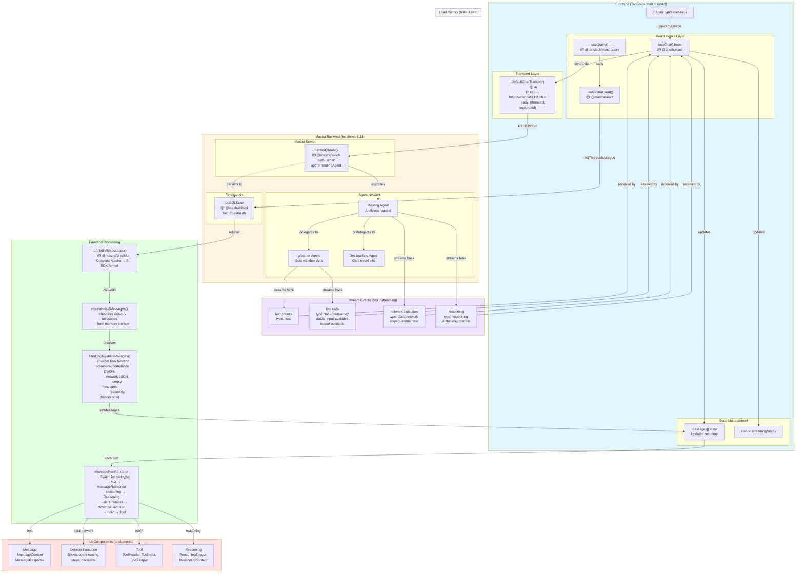

# Assistant - Mastra AI Chat

> **Example Project**: This is a demo application showcasing how to integrate **Mastra** with **TanStack Start**. It demonstrates best practices for building AI-powered applications with agent networks, real-time streaming, and dynamic UI components.

A real-time AI travel assistant built with **Mastra**, **TanStack Start**, and **AI SDK**. Features agent networks, streaming responses, and dynamic UI rendering for tool calls, reasoning, and network execution.

## About This Example

This project serves as a **reference implementation** for:

* **Integrating Mastra with TanStack Start** - Full-stack TypeScript setup
* **Agent Networks** - How to implement routing agents that delegate to specialized sub-agents
* **Real-time Streaming UI** - Rendering different stream event types (text, tools, reasoning, network execution)
* **Thread Persistence** - Managing conversation history with Mastra's memory system
* **AI SDK Integration** - Using `@ai-sdk/react` with Mastra's backend

Use this as a starting point for building your own AI-powered applications with Mastra and TanStack Start.

## Features

* 🤖 **AI Agent Network** - Routing agent delegates to specialized agents (weather, destinations)
* 🔍 **Web Search** - Real-time web search powered by Perplexity Sonar with source citations
* 🔄 **Real-time Streaming** - See AI responses, tool calls, and reasoning as they happen
* 💬 **Thread Persistence** - Chat history saved to SQLite via Mastra
* 📝 **Auto-generated Titles** - Thread titles automatically generated using Gemini Flash Lite
* 🎨 **Dynamic UI** - Renders different types of stream events:
  * Text responses
  * Tool invocations (parameters & results)
  * Web search sources with citations
  * Network execution (agent routing decisions)
  * Model reasoning (chain of thought)

## Prerequisites

* [Bun](https://bun.sh/) installed
* Google Gemini API key ([Get one here](https://aistudio.google.com/app/apikey))

## Getting Started

### 1. Install Dependencies

```bash
bun install
```

### 2. Configure Environment Variables

Create a `.env` file in the root directory:

```bash
GOOGLE_GENERATIVE_AI_API_KEY=your_gemini_api_key_here
PERPLEXITY_API_KEY=your_perplexity_api_key_here  # Optional: for web search
```

> **Important:** You must have a valid Gemini API key for the AI agents to work. The Perplexity API key is optional but required for web search functionality.

### 3. Run Development Server

```bash
bun run dev
```

This will start:

* **Mastra Backend** on `http://localhost:4111`
* **Frontend** on `http://localhost:3000`

### 4. Open the App

Navigate to `http://localhost:3000` and start chatting!

## Architecture: Stream System Flow



## How It Works

### 📤 Sending Messages (Streaming)

1. User types message → `useChat()` hook (@ai-sdk/react)
2. `DefaultChatTransport` → POST to `http://localhost:4111/chat`
3. Mastra backend receives via `networkRoute()` (@mastra/ai-sdk)
4. `routingAgent` analyzes and delegates to sub-agents or tools
5. Real-time stream events:
   * `text` chunks
   * `tool-*` invocations (including web-search with sources)
   * `data-network` agent execution
   * `reasoning` model thoughts
6. Frontend dynamically renders each part

### 📥 Loading History (Initial Load)

1. `useQuery()` + `useMastraClient()` → `listThreadMessages()`
2. `toAISdkV5Messages()` converts Mastra format → AI SDK format
3. `resolveInitialMessages()` resolves network execution data from memory (handles both agent and tool-based networks)
4. `filterDisplayableMessages()` removes internal system messages and reasoning from history (smart deduplication for agent vs tool networks)
5. `setMessages()` sets chat history

### 🎨 Rendering

`MessagePartRenderer` component switches on `part.type`:

* **text** → `<MessageResponse>`
* **data-network** → `<NetworkExecution>` (shows routing decisions)
* **tool-web-search** → `<Sources>` (web search results with citations)
* **tool-**\* → `<Tool>` (parameters and results for other tools)
* **dynamic-tool** → `<Sources>` or `<Tool>` (history: web-search shows sources, others show tool UI)
* **reasoning** → `<Reasoning>` (model thoughts, only during streaming)

### 🔧 Adding Custom Tool UIs

You can register custom UI components for your tools:

```tsx
import { toolUIRegistry } from '@/components/chat/renderers';

toolUIRegistry.register({
    toolIds: ['my-tool-id'],        // Tool ID(s) from Mastra
    Component: MyToolCard,           // Your React component
    isValidOutput: isMyToolData,     // Type guard function
});
```

The component will automatically render in **streaming** and **history** contexts.

See [`.agent/skills/tool-ui/SKILL.md`](.agent/skills/tool-ui/SKILL.md) for full documentation.

## Project Structure

```
src/
├── components/
│   ├── ai-elements/        # Reusable AI UI components
│   │   ├── network-execution.tsx  # Agent network visualization
│   │   ├── tool.tsx              # Tool call display
│   │   ├── reasoning.tsx         # Model reasoning display
│   │   └── ...
│   ├── chat/               # Chat-specific components
│   │   ├── chat-empty-state.tsx  # Empty state UI
│   │   ├── chat-input.tsx        # Message input with actions
│   │   ├── chat-layout.tsx       # Chat page layout wrapper
│   │   ├── message-part-renderer.tsx  # Renders message parts by type
│   │   └── index.ts              # Barrel exports
│   └── ui/                 # shadcn/ui components
├── hooks/
│   ├── use-chat-navigation.ts    # Navigate to chat with initial message
│   ├── use-delete-thread.ts      # Delete thread mutation
│   ├── use-invalidate-threads.ts # Invalidate threads query
│   ├── use-thread-messages.ts    # Fetch thread messages
│   └── use-threads.ts            # Fetch all threads
├── lib/
│   ├── chat-utils.ts             # Chat utility functions
│   ├── constants.ts              # Environment variables
│   ├── filter-displayable-messages.ts  # Filter system messages
│   ├── mastra-queries.ts         # Centralized query options & keys
│   ├── resolve-initial-messages.ts     # Resolve network messages from memory
│   └── utils.ts                  # General utilities
├── mastra/
│   ├── agents/             # AI agents
│   │   ├── routing-agent.ts      # Main routing logic
│   │   ├── weather-agent.ts      # Weather queries
│   │   └── destinations-agent.ts # Travel recommendations
│   ├── tools/              # Mastra tools
│   │   └── web-search-tool.ts    # Web search via Perplexity Sonar
│   ├── workflows/          # Mastra workflows
│   ├── memory.ts           # Memory configuration with title generation
│   └── index.ts            # Mastra configuration
└── routes/
    ├── index.tsx           # Home page
    └── chat.$threadId.tsx  # Chat page with thread support
```

## Building for Production

```bash
bun run build
```

## Linting & Formatting

This project uses [Biome](https://biomejs.dev/):

```bash
bun run lint      # Check for issues
bun run format    # Format code
bun run check     # Lint + format
```

## Tech Stack

* **Frontend Framework:** [TanStack Start](https://tanstack.com/start)
* **AI Framework:** [Mastra](https://mastra.ai/)
* **AI SDK:** [@ai-sdk/react](https://sdk.vercel.ai/docs)
* **State Management:** [TanStack Query](https://tanstack.com/query)
* **Styling:** [Tailwind CSS](https://tailwindcss.com/) + [shadcn/ui](https://ui.shadcn.com/)
* **AI Models:** 
  * Google Gemini 3 Flash Preview (main agent)
  * Google Gemini 2.5 Flash Lite (title generation)
  * Perplexity Sonar (web search)
* **Database:** SQLite (via @mastra/libsql)

## 🔧 Development Tools

### AI SDK DevTools

Para debugging de interacciones LLM durante desarrollo:

1. **Instalación:** `bun add -d @ai-sdk/devtools`
2. **Uso:** Ejecutar `bun dev` para iniciar la app y DevTools automáticamente
3. **Visualizar:** Abrir [http://localhost:4983](http://localhost:4983) para inspeccionar llamadas AI SDK

**DevTools captura automáticamente:**
- ✅ Todas las llamadas `generateText` y `streamText`
- ✅ Prompts enviados a modelos
- ✅ Respuestas recibidas
- ✅ Invocaciones de tools
- ✅ Interacciones multi-step (routing de agentes, network execution)
- ✅ Token usage y timing

**Nota:** DevTools almacena datos localmente en el directorio `.devtools/` (gitignored). Solo está activo en modo desarrollo.

**Deshabilitar DevTools:** Si necesitas deshabilitar DevTools temporalmente, usa:
```bash
AI_SDK_DEVTOOLS_ENABLED=false bun dev
```

## Learn More

* [Mastra Documentation](https://mastra.ai/docs)
* [AI SDK Documentation](https://sdk.vercel.ai/docs)
* [TanStack Start Documentation](https://tanstack.com/start)
* [TanStack Router Documentation](https://tanstack.com/router)
* [TanStack Query Documentation](https://tanstack.com/query)
